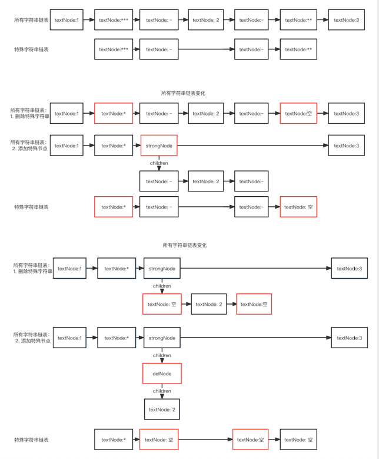

# markdown 编辑器

## 预览链接

[链接](https://wojiaofengzhongzhuifeng.github.io/markdown-editor/)

## 项目介绍

本项目使用原生 javascript 开发 markdown 编辑器，数据转化的链路为：

string(用户输入的markdown语法字符串) =解析流程> 链表(将字符串分割后，生成链表) =(渲染流程，使用 treewalker )> string(HTML 字符串)

## 常见问题

### 为什么要使用原生 js 接管输入事件？

可以更加灵活的控制显示内容，是实现「见即所得」模式的基础

### 架构如何分层的？

在传统 MVC 架构的基础上，做了修改，最终的架构是这样的：

- Model: 数据模型层，目前有两个数据模型，用于存储用户输入内容与当前光标位置
- View: 视图层，将 Model 层数据进行渲染；处理光标的位置
- controller: 核心模块，用于调度所有模型
- Event: 事件层，用于管理所有事件
- Operation: 原子操作层，将用户的实际操作转化为原子操作，如用户使用光标选择多个文字后，输入新文字，对于原子操作，实际是先删除，然后再插入，用于后续的撤销回退和协同操作编辑的功能扩展

### 【todo】如何实现行内元素解析

- 分割字符串

    对于 `1***~2~**3` 内容，首先把字符串分割为两个链表

- 将特殊字符串转化为特殊节点

  

### 【todo】如何实现块级元素解析

### 【todo】如何借助 treeWalker 实现渲染

### 单元测试
```text
1**2**3 => 1<b>2</b>3
1***2**3 => 1*<b>2</b>3
1***~2~**3 => 1*<b><del>2</del></b>3
```


